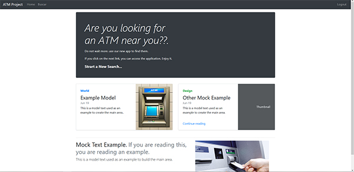

# AtmProject

## Description

This app allows us to consult an API that returns a list of geographic locations of ATM.
The app has a logging area, where it stores the session token in the local storage.

## Technology:
This project was generated with [Angular CLI](https://github.com/angular/angular-cli) version 9.1.9.

Othes library was:
- Bootstrap
- Jquery
- Popper.js

Mapbox API was used to render maps on screen.
For more information, you can reed the official documentation on:
- https://www.mapbox.com/

## Modules of the site.
The site are compose for 3 parts:
- Login Area
- Main Page
- ATM search Area

### 1. Loging Area
The Router structure and the Guard component are used to protect the access to the differents apps components.

The logging area send a post require to Rest Services and recived a token to guarantee the access.
This token is saved on the browser Local Storage.

### 2. Main Area
The main area is just a mock of a simple web page built with different templates of the bootstrap official page.
This page have a principal menu, where you can access to the ATM search area.

### 3. ATM search Area
In this section you can send a rest petition to the service and receive a list of ATM filtered by differents patterns like house number, city, postal code, etc.
The list is showed in a table, and you can access to the render map with the lateral right buttom.

